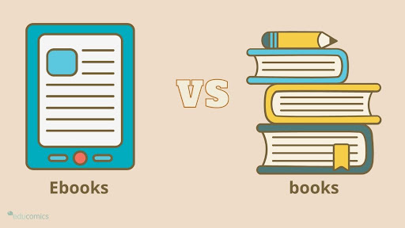

# Nguyen_Ho_midterm
MMED-1054 Midterm

# Physical book vs E-Book Debate

We are going to argue about whether Physical book or E-book are better. I am sure that the physical book is better and traditional.

## Installation

TODO: Describe the installation process of it.

## Usage

TODO: Write usage instructions

## Contributing

1. Fork it!
2. Create your feature branch: `git checkout -b my-new-feature`
3. Commit your changes: `git commit -am 'Add some feature'`
4. Push to the branch: `git push origin my-new-feature`
5. Submit a pull request :D

## History

February 15th, 2024

## Credits

Nguyen_Thi Thanh Thuong, Ho_Gia Khang

## License

MIT

